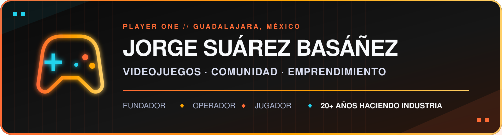
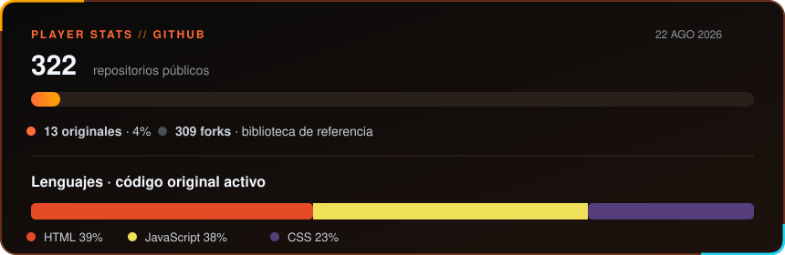

 

🎮 **SELECCIONA CANAL**

 

GM @ [Amber Studio México](https://amberstudio.com/location-guadalajara) · Founder · Emprendedor · Community builder · Gamer

---

## 👾 ¿Quién es Jorge?

Llevo más de 20 años jugando el modo historia del gaming mexicano: fundando estudios, formando equipos y abriendo camino desde Guadalajara. Fundé **KaraOkulta**, hoy lidero **Amber México** y sigo construyendo proyectos donde se cruzan videojuegos, comunidad, emprendimiento e IA.

Mi misión principal no ha cambiado: **ayudar a que más gente pueda vivir de hacer videojuegos**. Si estás construyendo algo interesante, bienvenida la partida co-op.

## 🕹️ Misiones activas

| Slot | Misión actual |
|---|---|
| 🎮 **[Amber Studio México](https://amberstudio.com/location-guadalajara)** | General Manager del estudio de Guadalajara. Parte de una red global de 850+ profesionales en 9 sedes y 4 continentes. |
| 🤝 **Ecosistema** | Invierto en startups de IA, soy LP de [Altered Ventures](https://venturecapital.game) (el fondo de Mario Valle Reyes en IA, gaming y tecnología inmersiva), asesoro a [Sparkplug Technologies](https://getsparkplug.com) y colaboro con fundadores que quieren construir en grande. |
| 🏛️ **Arden AC** | Co-Founder. Umbrella de [UETC](https://uetc.mx), [Brandcade](https://brandcade.com), [Logrus](https://logrus.jorgesuarez.com.mx) y [EGDC](https://club.uetc.mx). Desde UETC estamos construyendo **[EchoMentor AI](https://echomentor.jorgesuarez.com.mx)**. |
| 🏍️ **[Tecni Moto Garage](https://tecnimoto.jorgefsb.workers.dev)** | Socio fundador con mi tío. Taller de motos en Acoxpa, CDMX: servicio rápido, transparente y por WhatsApp. Ya abrimos el 1 de octubre de 2026. |

## 🚀 Builds seleccionados

| Player | Build / qué desbloquea |
|---|---|
| `01` **[Master Prompt Builder](https://github.com/jorgefsb/master-prompt-builder)** · [jugar ↗](https://mpb.jorgesuarez.com.mx) | Construye y exporta el contexto que quieres llevar a ChatGPT, Claude y otras IAs. |
| `02` **[EchoMentor AI](https://github.com/jorgefsb/echomentor-ai)** · [conócela ↗](https://echomentor.jorgesuarez.com.mx) | Plataforma de aprendizaje adaptativo con IA (UETC / Arden). Le das un tema o un PDF y arma una clase. Beta del Club UETC. |
| `03` **[SparkCrew](https://github.com/jorgefsb/sparkcrew-landing)** · [entrar ↗](https://sparkcrew.jorgesuarez.com.mx) | Explora una propuesta de equipos de IA por suscripción para PyMEs. |
| `04` **[Game Industry Resources](https://github.com/jorgefsb/game-industry-resources)** | Encuentra recursos para construir una carrera haciendo videojuegos en LATAM. |
| `05` **[jorgesuarez.com.mx](https://github.com/jorgefsb/jorgesuarez.com.mx)** · [explorar ↗](https://jorgesuarez.com.mx) | Recorre mi historia, proyectos y aprendizajes sobre gaming y emprendimiento. |

> 🎓 **EchoMentor AI** también tiene landing pública en [echomentor.jorgesuarez.com.mx](https://echomentor.jorgesuarez.com.mx). La plataforma vive en UETC; el código de la app sigue privado.
>
> También estoy desarrollando **PapacitoOS**, un sistema operativo personal con agentes especializados, memoria compartida y ciclos de seguimiento. El código sigue privado mientras madura.

## 🧰 Loadout actual

- **IA y agentes:** Claude · MCP · sistemas multiagente
- **Producto web:** TypeScript · JavaScript · Node.js · Next.js · Python
- **Plataforma:** Cloudflare · Vercel · Supabase
- **Videojuegos:** Unreal Engine · Unity · Roblox

## 📊 GitHub telemetry

La mayoría de mis repositorios públicos son forks que conservo como biblioteca de referencia. Este snapshot separa esa biblioteca del código original y muestra los lenguajes de mis repositorios públicos activos.

Snapshot del 22 de agosto de 2026, calculado con la API pública de GitHub. Los lenguajes agregan el código de repositorios originales, públicos y activos, excluyendo este perfil.

## 🏆 Achievements unlocked

**Shark Tank México** (2016) · **Forbes 30 Promesas** (2015) · **Cinépolis Accelerator Alumni** (2015) · **Cinépolis Seedcamp Winner** (2014)

---

**¿Hablamos?** [jorgefsb@gmail.com](mailto:jorgefsb@gmail.com) · Guadalajara, Jalisco 🇲🇽

